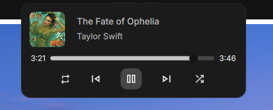

# Music Island

<table>
  <tr>
    <td></td>
    <td></td>
  </tr>
</table>

A minimal, animated music widget for Wayland desktops built with [Quickshell](https://quickshell.outfoxxed.me/) and Qt Quick.

[Showcase Video](https://www.youtube.com/watch?v=J5ZB7WCBuYo)

## Overview

Music Island renders a compact, pill-shaped music bar at the top of your screen. It uses MPRIS to detect any active media player and displays track info with smooth animations. On hover, the bar expands to reveal a full playback control panel.

- **Collapsed mode** — A slim pill showing album art, track title/artist, and animated audio visualizer bars. The title, artist, and visualizer cycle through automatically.
- **Expanded mode** — On hover, the pill smoothly expands to 400px wide, revealing album art, track info, a seek slider, and transport controls (repeat, previous, play/pause, next, shuffle).
- **Audio visualizer** — 14-bar frequency visualizer powered by [Cava](https://github.com/karlstav/cava), rendered in real-time from audio output.
- **Noctalia v5 color integration** — Colors are loaded from a JSON file generated by Noctalia's template system, so the widget automatically adapts to your system palette.

## Files

| File | Purpose |
|---|---|
| `shell.qml` | Main entry point. Defines the panel window, collapsed/expanded states, and carousel animation. |
| `Music.qml` | Singleton wrapping the MPRIS player API. Tracks active player, title, artist, album art, position, and provides helper functions. |
| `MusicControl.qml` | Expanded view with album art, title/artist, seek slider, and transport buttons. |
| `MusicBars.qml` | Animated audio visualizer bars driven by Cava data. |
| `Colors.qml` | Singleton that reads Material Design 3 color tokens from `noctalia-colors.json`. |
| `Cava.qml` | Singleton that spawns the Cava process and parses raw ASCII output into bar levels. |
| `assets/` | SVG icons for play, pause, repeat, shuffle, skip next, and skip previous. |

## Noctalia v5 Color Integration

Noctalia v5 renders the current palette into a JSON file, and this widget watches that file for live updates.

### 1. Create a Noctalia template

`~/.config/noctalia/templates/quickshell-colors.json`:

```json
{
<% for name, value in colors %>
  "<% name %>": "<% value.default.hex %>"<% if not {{ loop.last }} %>,<% endif %>
<% endfor %>
}
```

### 2. Register it in your Noctalia config

In `~/.config/noctalia/settings.toml` (or any `~/.config/noctalia/*.toml`):

```toml
[theme.templates.user.quickshell]
input_path  = "$XDG_CONFIG_HOME/noctalia/templates/quickshell-colors.json"
output_path = "$XDG_CONFIG_HOME/quickshell/noctalia-colors.json"
```

Noctalia renders user templates every time the palette/theme changes and skips rewriting the file when nothing changed, so you won't get spurious reloads.

## Dependencies

- [Quickshell](https://quickshell.outfoxxed.me/) with Wayland support
- Qt 6 (QtQuick, QtQuick.Controls, QtQuick.Effects, QtQuick.Layouts)
- [Cava](https://github.com/karlstav/cava) (optional, for audio visualizer)
- An MPRIS-compatible media player
